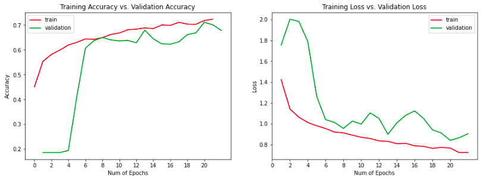
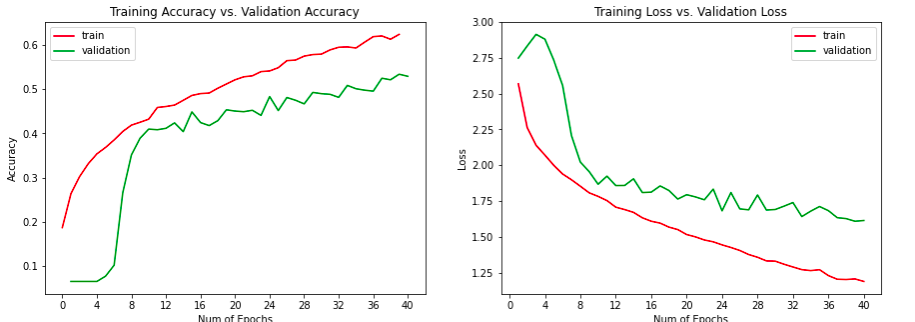
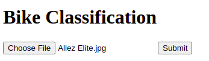
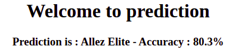
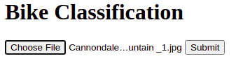
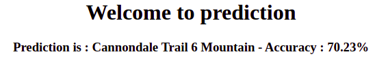

## bike_recognize
This is a project for recognition bikes

Author: **Nguyễn Đức Mạnh** ([ManhND27](https://github.com/ManhND27))
## python version 
> 3.9
## install 
> git clone https://github.com/ManhND27/bike_recognize
## install package 
> pip install -r requirements.txt
## running crawl data
Data crawl from Google image search by key : brand + model + type + year save on file 
using selenium
[brand_model_type_year.csv](https://github.com/ManhND27/bike_recognize/blob/main/data/brand_model_type_year.csv)

> python3 crawlData/GoogleImageScrapy/craw_image.py

* output when crawled, clean data and save on  ([data/data](https://drive.google.com/drive/folders/1gAyxFjwnREZwUry1sxm1-elped7Jwjku?usp=sharing))

* label save on ([data/data.csv](https://github.com/ManhND27/bike_recognize/blob/main/data/data.csv))
## Convert data 
Save to type array train_data and val_data (80:20) save to ([data/data_arr/image_arr.npz](https://drive.google.com/file/d/1sEWjH2LCnu6xtAfVW290hUexBBxkNlVf/view?usp=sharing))
> python3 train/convert_arr_data.py 
## Train model using VGG19
* Train model using **5 label** of brand specialzed ([train/model.ipynb](https://www.kaggle.com/codergay99/bike-reconigtion-model))
  * Save model on ([app/model_weight/model.h5](https://drive.google.com/file/d/1JmFmM9aC76SViE6Q54L7HnuBwda7ooFM/view?usp=sharing))
  * Model scratch model
  

  
* Train model using **15 label** brand_model_type ([train/brand_model_type](https://www.kaggle.com/manhnd99/build-model))
  * Save model on ([app/model_weight/brand_model_type.h5](https://drive.google.com/file/d/10hRoFgi4V96tTaXF_35LlLuE3C_z7A31/view?usp=sharing)) 
  * Model scratch model_brand_type
  

  

## Predict image bike using Flask
* Predict model of brand specialzed 
> python3 app/app_model.py

> 

> 
* Predict brand_model_type on [data/label_brand_model_type.csv](https://github.com/ManhND27/bike_recognize/blob/main/data/label_brand_model_type.csv)
> python3 app/app_brand_model_type.py

> 

> 
